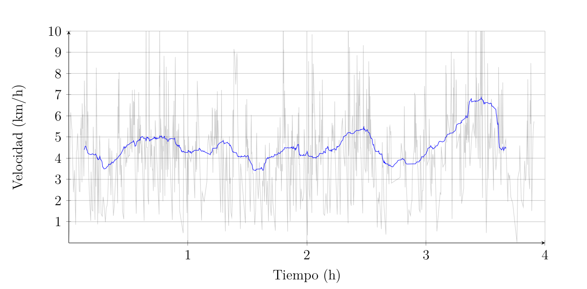

## Antecedentes: Actividad educativa paso por las Montañas Nubladas
La aplicación [Relive](https://www.relive.cc/), permite descargar el archivo `.gpx` donde vienen recogidos todos los datos necesarios para obtener las gráficas de nivel y de velocidad. El formato GPX es uno de las formas más extendidas de intercambio y almacenamiento de información georeferenciada. Los archivos con este formato pueden ser leídos e interpretados por multitud de programas ya que utilizan etiquetas XML, como `<time>`, `<trkpt>`, `<ele>`... Cuando un alumno abre la aplicación, le aparece la opción de registrar una nueva actividad, y después de activar el GPS de su móvil ya puede iniciar el registro de la misma (Registro 1). Al finalizar la actividad física, la aplicación nos deja guardarla con un nombre y descargar el archivo GPX resultante desde el área de usuario de su web.

| Registro 1 | Registro 2 | Registro 3 | Registro 4 |
|----------|----------|----------|----------|
|  |  |  |  |

Cada alumno deberá mandar al profesor su archivo GPX para que pueda transformarlo en dos gráficas: una de elevaciones y otra de velocidad. Para ello se ha diseñado un programa para hacer esto automáticamente.

## Explicación del programa
El programa lee todos los archivos `.gpx` de una carpeta dada y extrae los tiempos, latitudes, longitudes y altitudes de cada registro mediante expresiones regulares. A partir de las latitudes y longitudes, se calculan las distancias recorridas utilizando la fórmula

$\Delta (x1,x2) = R * 2 * arctan(sqrt((1-a)/a))$
siendo

$a = sin(\Delta lat/2)^2 + cos(lat_1) * cos(lat_2) * sin(\Delta lon/2)^2$
$\Delta lat = lat_2 - lat_1$
$\Delta lon = lon_2 - lon_1$

donde las latitudes y longitudes se expresan en radianes y R es el radio de la tierra en kilómetros.

Con las distancias entre cada par de registros sucesivos y los tiempos de éstos podemos calcular la velocidad. Para evitar una excesiva variabilidad en ésta se exporta la velocidad después de haber aplicado una media móvil. Esto es:

$\overline{v}_i = \frac{1}{w+1}\sum_{j=i}^{i+w} v_j, \quad i = 1,\dots,n-w$

Siendo v el vector de velocidades original, n su longitud, v̄ el resultado de la transformación y w el tamaño elegido para hacer la media $(1 ≤ w ≤ n)$. Esta transformación es necesaria ya que la baja precisión del GPS hace que los registros tengan mucho ruido haciéndose especialmente molesto en el caso de la velocidad:

Para el gráfico de alturas no es necesario hacer ningún tipo de transformación.

Ambas gráficas son representadas con el paquete `matplotlib` y exportadas en formato `.pdf` con el mismo nombre que tenía el archivo `.gpx`.
